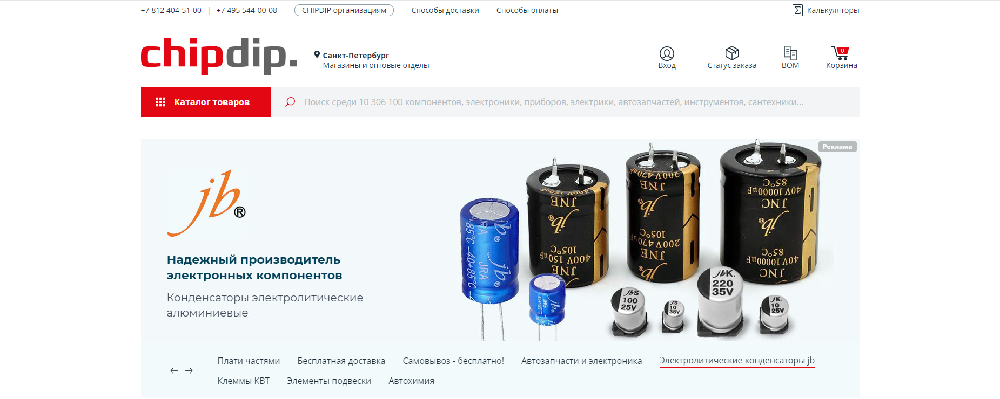
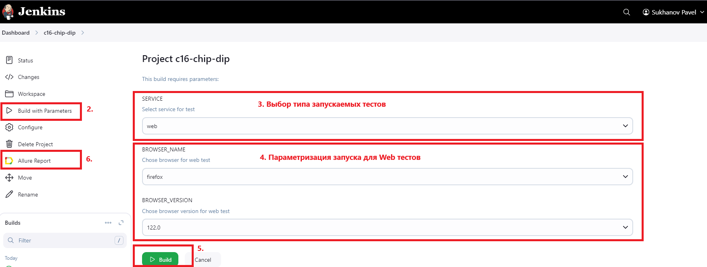
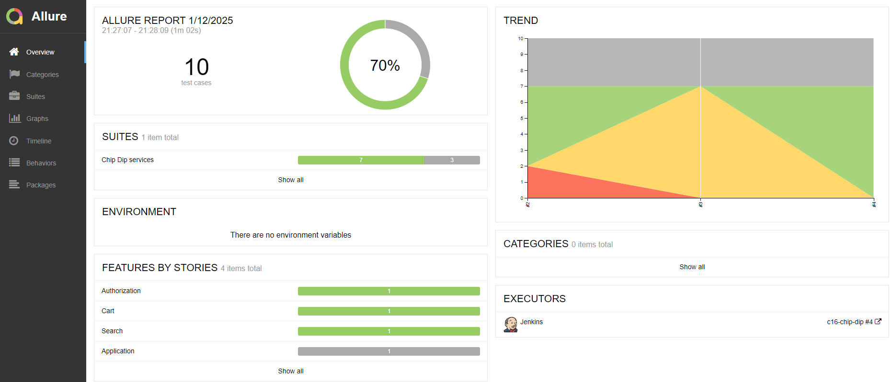
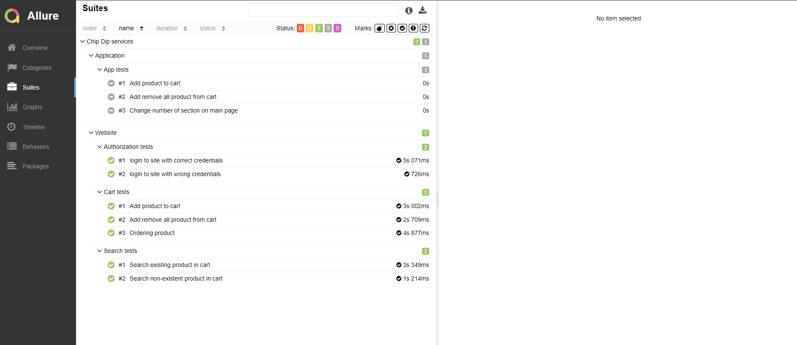
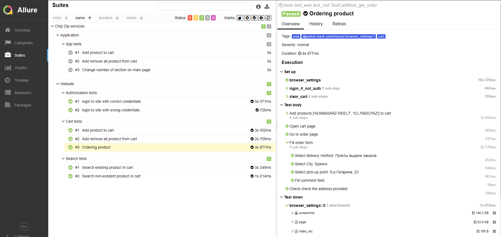
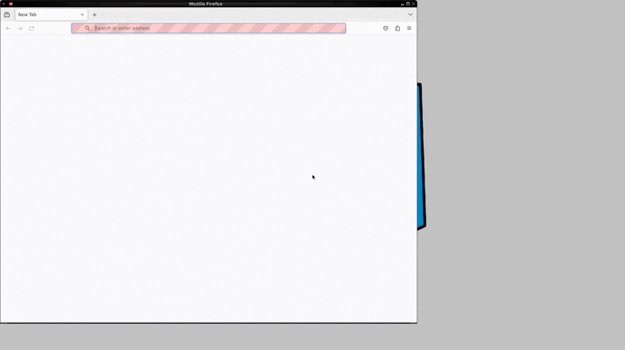

# Проект Web/Mobile тестирования сайта и приложения магазина ChipDip
> <a target="_blank" href="https://www.chipdip.ru/">ChipDip</a>

## Используемый стек технологий и инструментов

|                        Python                         |                        Pytest                         |                          Selen                          |                        Selenoid                         |                        Git                         |                        Jenkins                         |                        Allure                         |                        Allure TestOps                         |                        Appium                         |                        BrowserStack                         |                        Telegram                         |
|:-----------------------------------------------------:|:-----------------------------------------------------:|:-------------------------------------------------------:|:-------------------------------------------------------:|:--------------------------------------------------:|:------------------------------------------------------:|:-----------------------------------------------------:|:-------------------------------------------------------------:|:-----------------------------------------------------:|:-----------------------------------------------------------:|:-------------------------------------------------------:|
|  |  |  |  |  |  |  |  |  |  |  |

## Tесты
### UI
<ul style="list-style-type: '\2705 &#160'">
    <li>Login to site with correct credentials</li>
    <li>Login to site with wrong credentials</li>
    <li>Search existing product in cart</li>
    <li>Search non-existent product in cart</li>
    <li>Add product to cart</li>
    <li>Remove all product from cart</li>
    <li>Ordering product</li>
</ul>

### App
<ul style="list-style-type: '\2705 &#160'">
    <li>Add product to cart</li>
    <li>Remove all product from cart</li>
    <li>Change number of section on main page</li>
</ul>
https://jenkins.autotests.cloud/job/c16-chip-dip/

##  Запуск проекта в Jenkins
#### Для запуска автотестов в Jenkins
1. __Открыть проект <a href="https://jenkins.autotests.cloud/job/c16-chip-dip/">в Jenkins</a>__
2. __Выбрать пункт `Build with Parameters`__
3. __Выбрать тип запускаемых тестов в списке `SERVICE`(`web` или `api`)__
4. __Если выбран `web`, можно задать параметры браузера:__
   * __Браузер: `Chrome` или `Firefox`__
   * __А так же выбрать версию браузера__
5. __Нажать кнопку `Build`__
6. __Результат запуска сборки можно посмотреть в отчете Allure__

> <a target="_blank" href="https://www.chipdip.ru/">Jenkis</a>

##  Отчет в Allure report
>__Просмотр результатов выполнения тестов в Allure report__

>__Отчет позволяет получить общую информацию о прохождении тестов__

>__Отчет позволяет получить информацию о прохождении каждого теста__

__Каждый тесто содержит детальную информацию по всем шагам тестов, включая скриншоты, дам страницы и видео прохождения теста.__
>__Пример видео для теста вебсайта: (Оформление заказа)__

>__Пример видео для теста приложения: (Добавление товара в корзину)__
> 
